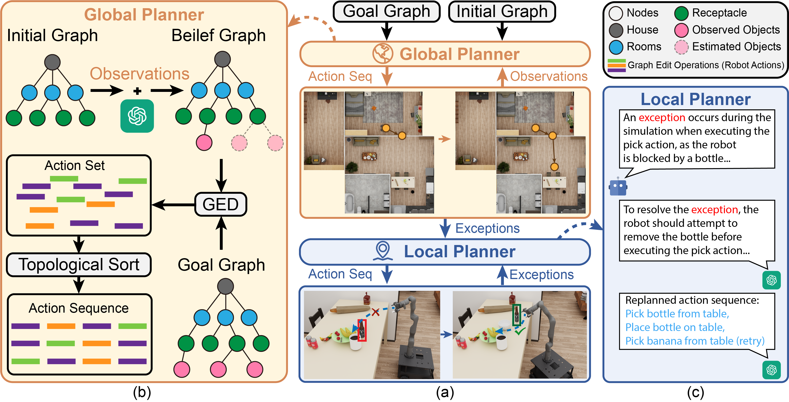
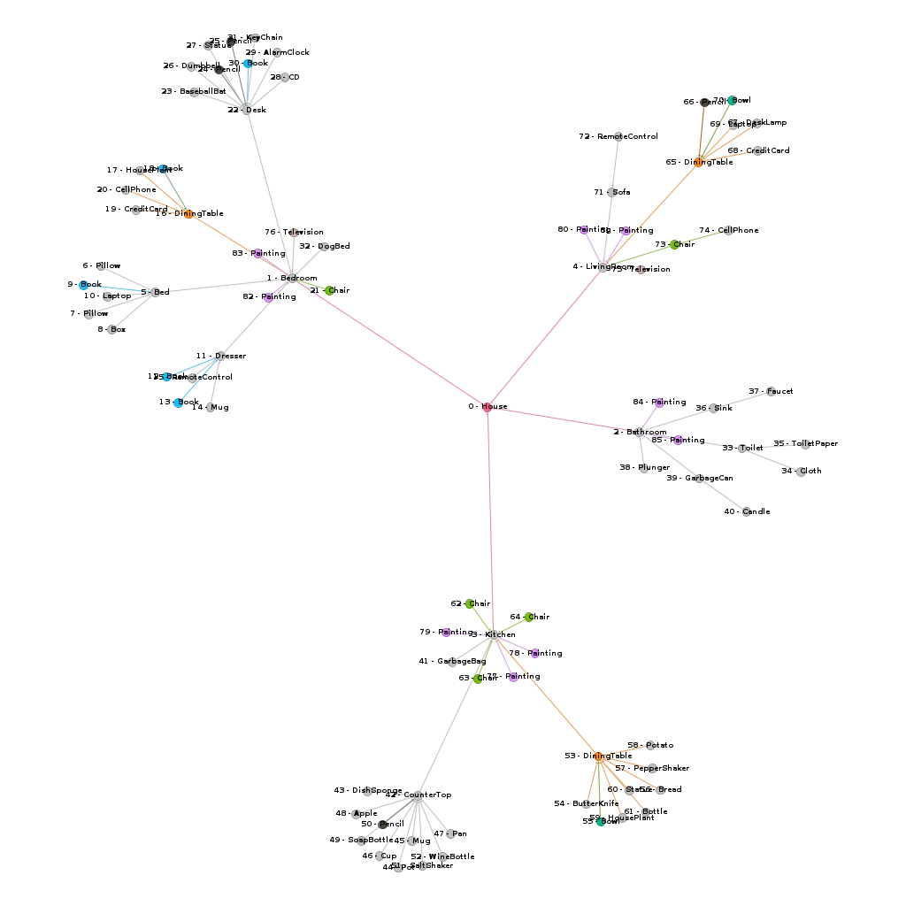

# EPoG: Integrated Exploration and Sequential Manipulation on Scene Graph with LLM-based Situated Replanning

<p align="center">
  <a href="https://arxiv.org/abs/2602.04419">
    
  </a>
  <a href="https://www.python.org/downloads/release/python-3100/">
    
  </a>
  <a href="https://opensource.org/licenses/MIT">
    
  </a>
  <a href="https://github.com/astral-sh/ruff">
    
  </a>
</p>

<p align="center">
  <b>ICRA 2026</b>
</p>

## Abstract

In partially known environments, robots must combine exploration to gather information with task planning for efficient execution. To address this challenge, we propose **EPoG**, an **E**xploration-based sequential manipulation **P**lanning framework **o**n Scene **G**raphs. EPoG integrates a graph-based global planner with a Large Language Model (LLM)-based situated local planner, continuously updating a belief graph using observations and LLM predictions to represent known and unknown objects. Action sequences are generated by computing graph edit operations between the goal and belief graphs, ordered by temporal dependencies and movement costs. This approach seamlessly combines exploration and sequential manipulation planning. In ablation studies across 46 realistic household scenes and 5 long-horizon daily object transportation tasks, EPoG achieved a success rate of **91.3%**, reducing travel distance by **36.1%** on average. Furthermore, a physical mobile manipulator successfully executed complex tasks in unknown and dynamic environments, demonstrating EPoG's potential for real-world applications.

## Framework Overview

<p align="center">
  
</p>

The EPoG framework employs a bi-level planning architecture:

- **Global Planner**: Constructs and updates a belief graph using observations and LLM predictions. Generates action sequences via Graph Edit Distance (GED) computation and topological sorting.
- **Local Planner**: Uses LLM-based situated replanning to handle exceptions (blocking, collision, inaccessibility, instability) during execution.

### Key Features

- **Belief Graph Estimation**: Leverages LLM commonsense knowledge to estimate unknown object locations
- **Graph Edit Distance Planning**: Generates optimal action sequences by computing edit operations between belief and goal graphs
- **Situated Replanning**: Handles motion planning exceptions through LLM-guided recovery actions
- **Integrated Exploration**: Seamlessly combines exploration and manipulation to minimize travel distance

## Installation

### Requirements

- Python 3.10 (required)
- CUDA-compatible GPU (recommended for sentence-transformers)
- [uv](https://docs.astral.sh/uv/) package manager (recommended) or pip

### Dependencies

Core dependencies include:
- `ai2thor-colab`: Household simulation environment
- `networkx`: Graph algorithms
- `openai`: LLM API access
- `pybullet`, `python-fcl`: Physics simulation and collision detection
- `sentence-transformers`: Semantic embeddings

### Quick Start

```bash
# Clone the repository
git clone https://github.com/yangheqing/epog.git
cd epog

# Install with uv (recommended)
uv sync

# Or install with pip
pip install -e .
```

### Development Setup

```bash
# Install development dependencies
uv sync --group dev

# Install pre-commit hooks
uv run pre-commit install
```

## Dataset

### Benchmark Tasks

We evaluate on 5 long-horizon daily object transportation tasks across 46 household scenes from the [ProcThor-10k](https://procthor.allenai.org/) dataset:

| Task | # Scenes | Goals |
|------|----------|-------|
| Breakfast Preparation | 10 | apple on plate, bread on plate, fork on plate, plate on diningtable |
| Bedroom Work | 10 | alarmclock on desk, CD on desk, laptop on desk, pencil on desk |
| Movie & Snack Preparation | 10 | remotecontrol on sofa, bread on plate, plate on diningtable |
| Tea Making & Relaxation | 10 | kettle on countertop, cup on diningtable, remotecontrol on sofa |
| Bath Preparation | 6 | soapbottle on faucet, cloth on faucet |

### Exception Types

Four types of motion planning exceptions are randomly generated in each scene (2 per scene):
- **Blocking**: Objects obstruct the manipulation path
- **Collision**: Placed objects would collide with the environment
- **Inaccessibility**: Container must be opened before object retrieval
- **Instability**: Manipulation would cause stacked objects to become unstable

### Data Generation

```bash
# Generate benchmark dataset
uv run python epog/data_gen/task_proc_scene.py
```

To visualize scene graphs (`*.gexf` files), use [Gephi](https://gephi.org/):

<p align="center">
  
</p>

## Usage

### Configuration

Set your OpenAI API key:

```bash
export OPENAI_API_KEY="your-key-here"
```

### Running Evaluation

```bash
# EPoG (Ours) - Full framework with LLM-based belief estimation and local replanning
uv run python epog/evaluation/eval.py --algorithm_name EPoG

# EFS - Exploration-First Search baseline
uv run python epog/evaluation/eval.py --algorithm_name EFS

# LLM+Explore - Exploration followed by LLM planning
uv run python epog/evaluation/eval.py --algorithm_name "LLM+Explore"

# LLM Pure - Pure LLM-based planning
uv run python epog/evaluation/eval.py --algorithm_name LLM_Pure
```

### Command Line Arguments

| Argument | Default | Description |
|----------|---------|-------------|
| `--algorithm_name` | `LLM_Pure` | Algorithm to evaluate: `EPoG`, `EFS`, `LLM+Explore`, `LLM_Pure` |
| `--data_root_dir` | `data/task` | Root directory for task data |
| `--work_dir` | `work_dir` | Output directory for results |

## Results

### Ablation Study

| Method | Breakfast Prep. | | | Bedroom Work | | | Movie & Snack | | | Tea Making | | | Bath Prep. | | | **Total** | | |
|:------:|:---:|:---:|:---:|:---:|:---:|:---:|:---:|:---:|:---:|:---:|:---:|:---:|:---:|:---:|:---:|:---:|:---:|:---:|
| | SR | EN | TD | SR | EN | TD | SR | EN | TD | SR | EN | TD | SR | EN | TD | **SR** | **EN** | **TD** |
| LLM | 10.0 | +0.0 | +110 | 10.0 | +0.0 | +48.7 | 10.0 | +0.0 | +179 | 40.0 | +10.3 | +115 | 16.7 | +0.0 | +16.7 | 17.4 | +2.05 | +93.9 |
| Exp.+LLM | 40.0 | +77.9 | +80.6 | 40.0 | +75.9 | +84.0 | 40.0 | +50.4 | +248 | 60.0 | +75.0 | +124 | 16.7 | +168 | +63.2 | 41.3 | +89.4 | +120 |
| Exp.+PoG | 100 | +77.2 | +59.0 | 100 | +50.4 | +25.0 | 100 | +66.5 | +112 | 100 | +67.9 | +122 | 100 | +104 | +60.5 | 100 | +73.2 | +75.6 |
| **EPoG** | **100** | 52.1 | 35.8 | **100** | 50.8 | 52.1 | 80.0 | 52.9 | 33.0 | 90.0 | 52.1 | 23.5 | 83.3 | 46.4 | 43.6 | **91.3** | **51.9** | **37.8** |

**Metrics:**
- **%SR** (Success Rate): Percentage of successfully completed tasks (higher is better)
- **%EN** (Expanded Nodes): Relative difference in explored nodes compared to EPoG (lower is better)
- **%TD** (Travel Distance): Relative difference in travel distance compared to EPoG (lower is better)

### Key Findings

1. **Integrated Planning**: EPoG naturally integrates exploration and sequential manipulation, reducing total execution effort
2. **Superior Success Rate**: EPoG (91.3%) significantly outperforms pure LLM planners (17.4%) on long-horizon tasks
3. **Efficiency**: 36.1% reduction in travel distance and 40.0% reduction in explored nodes compared to Exploration+PoG baseline
4. **LLM Limitations**: Pure LLM planners struggle with complex scene graphs and spatial reasoning

## Project Structure

```
epog/
├── epog/                          # Main application module
│   ├── algorithm/                 # Planning algorithms
│   │   ├── baseline/              # Baseline methods (LLM, LLM+Explore)
│   │   ├── efs/                   # Exploration-First Search
│   │   ├── epog/                  # EPoG algorithm implementation
│   │   │   ├── EPoG.py            # Main algorithm class
│   │   │   ├── planner_dynamic.py # Dynamic planner with LLM integration
│   │   │   ├── problem_dynamic.py # Planning problem definition
│   │   │   └── fake_simulator.py  # Motion planning simulation
│   │   └── llm_prompt/            # LLM prompt templates
│   │       ├── object_room_location.py      # Room prediction
│   │       ├── object_receptacle_location.py # Receptacle prediction
│   │       └── action_replanner.py          # Exception handling
│   ├── data_gen/                  # Dataset generation
│   │   ├── task_list.py           # Task definitions
│   │   └── task_proc_scene.py     # Scene generation from ProcThor
│   ├── envs/                      # Environment wrappers
│   │   ├── graph.py               # SceneGraph, SceneNode, SceneEdge
│   │   ├── proc_env.py            # ProcThor environment wrapper
│   │   ├── proc_scene.py          # Scene loading and parsing
│   │   └── navigation.py          # Navigation utilities
│   ├── evaluation/                # Evaluation pipeline
│   │   ├── eval.py                # Main evaluation script
│   │   └── post_summary.py        # Results aggregation
│   └── utils/                     # Utilities
│       └── gpt_helper.py          # OpenAI API wrapper
├── pog/                           # Core graph planning library
│   ├── algorithm/                 # Optimization algorithms
│   ├── graph/                     # Graph data structures
│   │   ├── graph.py               # Base Graph class
│   │   ├── node.py                # Node representation
│   │   ├── edge.py                # Edge representation
│   │   ├── shape.py               # Shape and affordance definitions
│   │   └── shapes/                # Specialized container shapes
│   └── planning/                  # Planning algorithms
│       ├── planner.py             # A* search implementation
│       ├── problem.py             # Planning problem abstraction
│       ├── action.py              # Action representation
│       ├── ged.py                 # Graph Edit Distance
│       └── searchNode.py          # Search state representation
├── third_party/                   # Third-party dependencies
│   └── sdf/                       # SDF generation library
├── data/                          # Dataset directory (generated)
├── work_dir/                      # Evaluation outputs
├── pyproject.toml                 # Project configuration
└── README.md                      # This file
```

## Algorithm Details

### Graph-Based Scene Representation

The scene is represented as a hierarchical tree:
- **Level 0**: House (root node)
- **Level 1**: Rooms (Kitchen, Bedroom, etc.)
- **Level 2**: Receptacles (tables, shelves, cabinets)
- **Level 3+**: Objects (task-relevant items)

### Belief Graph Estimation

For each missing object in the initial graph:
1. Query LLM to estimate most likely room
2. Query LLM to estimate most likely receptacle within that room
3. Add estimated node and edge to belief graph

### Action Sequence Generation

1. Compute Graph Edit Distance (GED) between belief and goal graphs
2. Map edit operations to robot actions:
   - `delete(edge)` → `Pick(object, parent)`
   - `insert(edge)` → `Place(object, parent)`
   - `substitute(opened)` → `Open(container)`
   - `substitute(closed)` → `Close(container)`
3. Apply topological sort respecting temporal constraints
4. Optimize for minimum travel distance using A* search

### Exception Handling

The local planner handles four exception types via LLM-guided recovery:
- **Blocking**: Move blocking objects to parking area
- **Collision**: Relocate colliding objects
- **Inaccessibility**: Open containers before manipulation
- **Instability**: Adjust stacking order

## Development

### Code Quality

This project uses modern Python development tools:

```bash
# Format code
uv run ruff format .

# Lint code
uv run ruff check . --fix

# Type check
uv run mypy epog pog

# Run all pre-commit hooks
uv run pre-commit run --all-files
```

### Running Tests

```bash
uv run pytest tests/ -v
```

## Citation

If you find this work useful in your research, please consider citing:

```bibtex
@inproceedings{yang2026epog,
  title={Integrated Exploration and Sequential Manipulation on Scene Graph with LLM-based Situated Replanning},
  author={Yang, Heqing and Jiao, Ziyuan and Wang, Shu and Niu, Yida and Liu, Si and Liu, Hangxin},
  booktitle={IEEE International Conference on Robotics and Automation (ICRA)},
  year={2026}
}
```

## Acknowledgments

This work builds upon several open-source projects:
- [AI2-THOR](https://ai2thor.allenai.org/) for the simulation environment
- [ProcThor-10k](https://procthor.allenai.org/) for procedurally generated household scenes
- [NetworkX](https://networkx.org/) for graph algorithms

## License

This project is licensed under the MIT License - see the [LICENSE](LICENSE) file for details.

## Contact

For questions or issues, please open an issue on GitHub or contact the authors.
