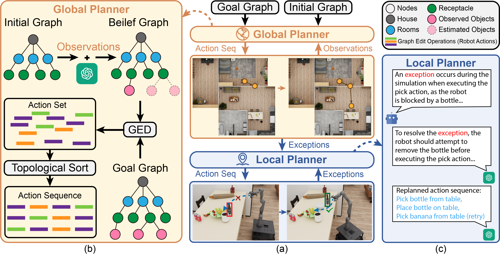
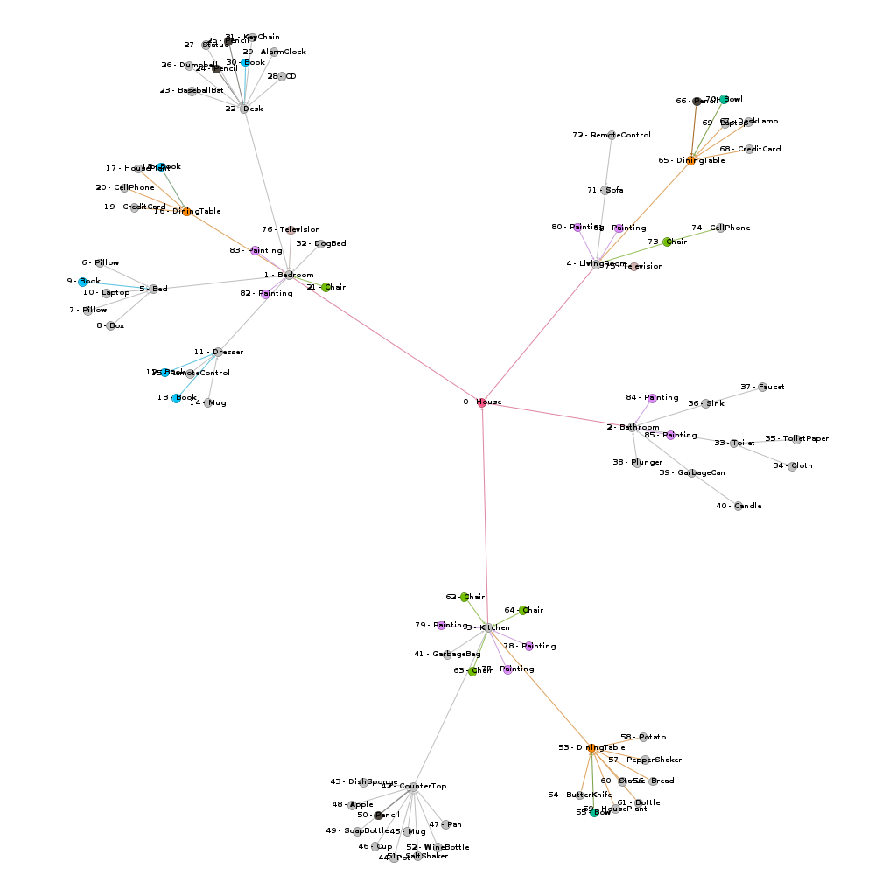

# Integrated Exploration and Sequential Manipulation on 3D Scene Graphs with Situated Replanning

## Framework



Overview of the proposed EPoG framework. (a) The bi-level structure of EPoG. (b) The belief graph is updated by estimating the distribution of target objects present in the goal graph but missing in the initial graph, using a pre-trained LLM and new observations. The action sequence is generated by performing the topological sort on the graph edit operations derived from evaluating the GED between the belief graph and the goal graph. (c) The LLM generates a situated action sequence to handle exceptions encountered during execution.

## Installation

```bash
conda create -n epog python=3.10
conda activate epog

pip install -r requirements.txt

cd third_party/sdf && pip install -e .
pip install numpy==1.26.4
```

## Evaluation

### data preparation

We evaluate five complex, long-horizon daily object transportation tasks, summarized in Table I: 1) Breakfast Preparation, 2) Bedroom Work, 3) Movie and Snack Preparation, 4) Tea Making and Relaxation, and 5) Bath Preparation. A total of 46 scenes were filtered from the ProcThor-10k dataset, each containing task-relevant objects. Four types of exceptions were randomly generated near these objects in each scene, with two exceptions present per scene. To generate the dataset:

```bash
export PYTHONPATH="${PYTHONPATH}:$(pwd)"
python epog/data_gen/task_proc_scene.py
```

To visualize the scene graph data(*.gexf), you can download gephi at https://gephi.org/, like this:


### evaluation

Firstly, you should replace {OPENAI_KEY} in the `epog/utils/gpt_helper.py`

```bash
python epog/evaluation/eval.py --algorithm_name ['EFS', 'EPoG', 'LLM+Explore', 'LLM_Pure']
```

## results
|     Method      |     Breakfast Prep.     |                           |                           |      Bedroom Work       |                           |                           |  Movie and Snack Prep.  |                           |                           |  Tea Making \& Relax.   |                           |                           |       Bath Prep.        |                           |                           |          Total          |                           |                           |
| :-------------: | :---------------------: | :-----------------------: | :-----------------------: | :---------------------: | :-----------------------: | :-----------------------: | :---------------------: | :-----------------------: | :-----------------------: | :---------------------: | :-----------------------: | :-----------------------: | :---------------------: | :-----------------------: | :-----------------------: | :---------------------: | :-----------------------: | :-----------------------: |
|                 | \textbf{\%SR}$\uparrow$ | \textbf{\%EN}$\downarrow$ | \textbf{\%TD}$\downarrow$ | \textbf{\%SR}$\uparrow$ | \textbf{\%EN}$\downarrow$ | \textbf{\%TD}$\downarrow$ | \textbf{\%SR}$\uparrow$ | \textbf{\%EN}$\downarrow$ | \textbf{\%TD}$\downarrow$ | \textbf{\%SR}$\uparrow$ | \textbf{\%EN}$\downarrow$ | \textbf{\%TD}$\downarrow$ | \textbf{\%SR}$\uparrow$ | \textbf{\%EN}$\downarrow$ | \textbf{\%TD}$\downarrow$ | \textbf{\%SR}$\uparrow$ | \textbf{\%EN}$\downarrow$ | \textbf{\%TD}$\downarrow$ |
|     llm based     |          10.0           |           +0.0            |           +110            |          10.0           |           +0.0            |           +48.7           |          10.0           |           +0.0            |           +179            |          40.0           |           +10.3           |           +115            |          16.7           |           +0.0            |           +16.7           |          17.4           |           +2.05           |           +93.9           |
| Exp. + llm |          40.0           |           +77.9           |           +80.6           |          40.0           |           +75.9           |           +84.0           |          40.0           |           +50.4           |           +248            |          60.0           |           +75.0           |           +124            |          16.7           |           +168            |           +63.2           |          41.3           |           +89.4           |           +120            |
|   Exp. + PoG    |           100           |           +77.2           |           +59.0           |           100           |           +50.4           |           +25.0           |           100           |           +66.5           |           +112            |           100           |           +67.9           |           +122            |           100           |           +104            |           +60.5           |           100           |           +73.2           |           +75.6           |
|  epog (ours)   |           100           |           52.1            |           35.8            |           100           |           50.8            |           52.1            |          80.0           |           52.9            |           33.0            |          90.0           |           52.1            |           23.5            |          83.3           |           46.4            |           43.6            |          91.3           |           51.9            |           37.8            |